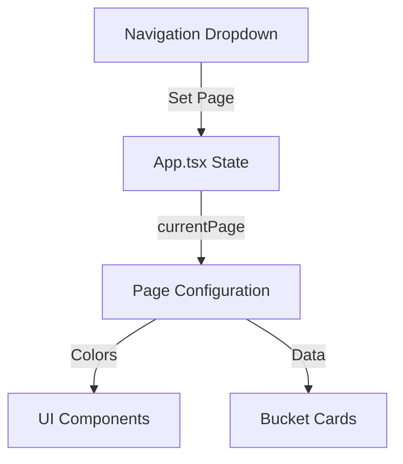

# Implementation Plan - Multi-Page Prompt Lab

I will transition the existing single-page application into a multi-mode app that supports both the original **Creative Suite** and the new **Problem Statement** generator.

## 1. Data Structure Changes
Create [`Prompt-Lab/src/types.ts`](Prompt-Lab/src/types.ts) to define the structure for a "Page Config":
```typescript
export interface Bucket {
  id: string;
  title: string;
  options: string[];
  btnLabel: string;
}

export interface PageConfig {
  id: string;
  name: string;
  version: string;
  primaryColor: string; // Tailwind color or hex
  highlightColor: string; // For the underlined text
  buckets: [Bucket, Bucket, Bucket];
  promptPrefix: string;
}
```

## 2. Constants Centralization
Move all strings to [`Prompt-Lab/src/constants.ts`](Prompt-Lab/src/constants.ts), including the new "Problem Statement" data.

## 3. Navigation Component
I will use a simple HTML `select` or a custom menu in the header of [`Prompt-Lab/src/App.tsx`](Prompt-Lab/src/App.tsx) to switch between pages.

## 4. Dynamic Styling
The app will use CSS variables or dynamic Tailwind classes to swap the "primary" color from Blue (Creative) to Green/Teal (Problem Statement).

## Mermaid Diagram



Does this plan look good to you? I'll start by organizing the data if you approve.
